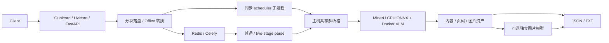

# 架构与目录约定

本文件供开发维护使用，不经文档 API 提供。系统按 HTTP 接入、任务编排、解析适配、模型推理和资产存储分层；同一份文档保持完整解析，不按单页拆成独立任务。

## 请求与资源边界

- Router 负责字段、鉴权后的请求编排与 HTTP 合同。阻塞 I/O 经线程池执行；不是给每个同步函数加 async 就能非阻塞。
- `upload_io.py` 以 1 MiB 缓冲复制 Starlette 已接收的 UploadFile，避免第二份整文件内存副本。它不是在 multipart 接收前限流，也不构成文件体积上限。
- `gpu_scheduler.py` 为同步/普通任务提供独立解析子进程、hard timeout 和进程组收尾。Future 用异步包装等待；HTTP 超时后先保留源文件，任务结束再删除。
- `parse_capacity.py` 在所有本机解析入口共享 Linux 文件锁容量。API worker 数量只改变 HTTP 容量；缺省解析上限仍为 3。不同机器/不共享锁目录的容器不受同一上限约束。
- `mineru_service_full.py` 是上游 SDK 适配层，保存资产后归一化业务字段、页码、阅读顺序与 checkbox。新 MinerU 输出变化优先在此吸收。
- two-stage 的 parse/dispatch/vision/merge 是独立阶段，使用 chord 汇总，不在 Celery task 内阻塞等待其他 task。独立图片模型的并发与解析槽位分开。

## 目录

| 路径 | 责任 |
| --- | --- |
| `README.md` / `AGENTS.md` | 人类入口 / 代理修改规则 |
| `docs/` | 当前专题文档与历史证据；仅 AI 指南被路由显式读取 |
| `deploy/manage.sh` | 本项目组件的启动、停止、重启和状态入口 |
| `deploy/pm2/` | 稳定进程名、队列、退出窗口；cjs 将路径解析为绝对路径 |
| `deploy/gunicorn.conf.py` | HTTP worker、超时、回收；从进程环境/.env 读取 |
| `deploy/mineru-vllm/` | Dockerfile、Compose 拓扑和前台启动器 |
| `src/routers/` | HTTP 合同 |
| `src/services/` | 调度、解析、图片模型、资产及任务编排 |
| `src/utils/` | 文件转换、输入边界、上传、文本与响应辅助 |
| `src/scripts/` | 批量客户端和压测工具 |
| `tests/` | 单元/合同/生命周期及显式启用的真实模型回归 |
| `input/` / `output/` / `.secrets/` | 私有输入、实验与凭证，不提交 |

## 修改与验证

先为可观察的错误写失败测试，再修改实现。常规测试可隔离 GPU/Redis，但必须明确测试边界；解析质量通过 input 真实 PDF 验证，不能用替身代表实测。部署变更同时检查工作目录、队列消费者、信号传递、重启恢复和在途文件生命周期。重要里程碑审查暂存内容并独立提交，不将日志、凭证或原始文档加入提交。

PM2 负责进程恢复，Gunicorn 管理 API 子进程，Docker 内 vLLM 管理模型副本。三者层次不同；增加 HTTP worker 不等于扩容模型。API 不 preload 已初始化的调度器/客户端。模型、Python 和依赖升级分别记录版本与回滚路径。

批量 CLI 日志默认进入 `output/logs`，`TWO_STAGE_LOG_FILE` 可指定位置。旧 `tests/test_celery.py` 并非测试，导入会重置全局日志且使用无界批量提交，已移除；历史源码保留在 Git。生产批处理遵循 AI 指南的有界在途与任务 ID 持久化规则。

## 批量客户端边界

`src/scripts/batch_parse.py` 负责 CLI 配置、文件扫描、HTTPX 流式上传及三个异步接口的字段适配；`batch_runner.py` 负责共享滚动窗口、原子落盘和任务恢复。`two_stage_enqueue.py` 为兼容入口，保持旧请求身份与 pickle 目录格式。新客户端只通过公开 HTTP API，不直接调用 Celery 或读取服务端任务目录；没有新增服务路由。

新输出目录以批次身份区分工作流，结果/输入摘要防止错误跳过。客户端并发只约束自身，不能替代服务端跨调用者准入、长任务执行隔离、消息幂等或按页断点恢复。详见[统一批量说明](batch-processing.md)。
