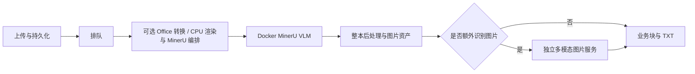

# MinerU 服务调优指南（仓库开发文档）

本文件作为开发运维文档提交 Git，但不通过 FastAPI、llms.txt 或服务文档路由暴露。运行凭证、原始文档和实测输出仍保持私有；不得通过通用静态目录挂载仓库。

适用基线：MinerU 4.0.2、Python 3.13.15、CPU ONNX 小模型、Docker vLLM 0.21.0、FastAPI 与 Celery。本指南给出资源变化后的测量与选择方法；表中的本机值是已测起点，不是新机器的通用最优值。

安装与故障恢复见[部署与恢复](mineru_4_upgrade_usage.md)，接口调用见 [AI 接入指南](ai-integration.md)。先按部署文档获得能正确解析的系统，再调性能。

## 1. 先确定要优化的目标

分别记录以下目标，避免把吞吐提升误认为单文件延迟下降：

- **交互延迟**：单文件从提交到完整结果的 P50/P95，以及冷启动与已预热差异。
- **批处理吞吐**：固定混合文件集的总完成时间、成功页/秒、成功文档/分钟、失败率和积压量。
- **质量与成本约束**：关键数字/表格/公式/checkbox/阅读顺序的正确性；每页 CPU 时间、GPU 时间、视觉输入/输出 token、内存峰值和临时磁盘峰值。

先写下可接受的 P95、错误率和质量门槛。例如“在关键字段全部通过的前提下优化整批耗时”，不要事后用更低档位或删掉图片来解释加速。不能直接比较纯解析与额外图片增强的耗时。

## 2. 理解实际流水线



一份文件的端到端时间包含上传、Office 转换、排队、解析、图片增强、拼接、存储与轮询观察延迟。阶段内部可并行，不能把多线程 cProfile 的累计时间直接相加当成墙钟时间。

本服务有两套大模型服务：

| 服务 | 配置入口 | 工作内容 | 当前分配方式 |
| --- | --- | --- | --- |
| MinerU VLM | `MINERU_MODEL_VLM_SERVER_URL` | 版面区域解析等 MinerU 推理 | 本机单容器、DP=3、TP=1，单 URL 内部分配请求 |
| 独立图片描述 | `VLLM_BASE_URLS` / `VLLM_BASE_URL` | 对提取图片补充事实描述 | 数量取决于 VLLM_BASE_URLS；本机共享轮换和每端点并发槽位，临时故障冷却后切换；使用共同模型名 |

图片模型的轮询不是按 GPU 利用率或队列深度加权；MinerU 多 URL 池也没有图片服务同样的故障切换语义。相同 URL 的多个别名不等于新增推理容量。

DP 主要增加可同时处理的请求数。一个长文档如果产生很多独立区域请求，也可能因多个副本同时工作而提速，但单次自回归生成不会自动被三卡分成三段。不要先把 PDF 拆成单页任务以追求均分：整本后处理、跨页连续性和源页号是必须保留的合同。

## 3. 建立资源账本

每次变更记录 Git commit、`uv.lock`、容器镜像及实际 digest、模型/量化版本、有效配置、CPU/GPU 拓扑和测试文件摘要。不要把 `.env`、密钥、真实模型服务地址、文档内容或完整 PM2 环境写入公共报告。

本机只读盘点命令：

```bash
lscpu
free -h
nvidia-smi --query-gpu=index,name,memory.total,memory.used,utilization.gpu --format=csv
df -h .
pm2 status
docker compose --env-file .env -p mineru-vlm-parallel -f deploy/mineru-vllm/compose.mineru.yaml -f deploy/mineru-vllm/compose.mineru.parallel.yaml ps
```

还需检查任务临时目录所在文件系统的容量，并记录容器或 cgroup 的 CPU/内存配额、NUMA、GPU 间互联、共享 GPU 上其他服务的峰值、Redis/磁盘/网络延迟。宿主机总核数和总内存不一定是本服务可用资源。

以下仅用于规划实验，不是硬性计算公式：

- CPU 压力约随“活跃解析进程 × 每个模型会话的 intra 线程”增长；每进程还可能有多个会话、PDF 渲染池和网络线程。
- RAM 峰值约为常驻模型/服务，加上各活跃文档的渲染、布局、图片、上传及输出缓存；不能只按 PDF 文件体积估算解码图片内存。
- 每 GPU 显存需求包括权重、KV cache、视觉 encoder、中间激活及运行时保留。`gpu-memory-utilization` 是预算，不是 OS 级隔离，也不保证别的进程随后申请显存时仍有余量。
- 稳态平均在途数可用 Little 定律 `L ≈ λ × W` 帮助理解；不要用平均值替代 P95 或忽略突发、失败重试和文件长尾。

本机基线：3 个 parse solo worker、ONNX intra/inter=16/1、每 parser VLM 并发 8、处理窗口 64 页；Docker DP/TP=3/1、每 GPU 显存比例 0.15、max-model-len=8192、max-num-seqs=16；two-stage vision threads=32；同步图片每请求窗口 3；统一批量客户端在途 2；API、普通与 two-stage 共享实际解析上限 3。基础 Compose 的单卡替代与三卡模板不能同时管理同一 project。

## 4. 用同一套样本建立基准

### 4.1 样本与正确性门槛

测试中的固定样本清单包含：p2 短表格/checkbox、九页论文的公式与图、46 页 fese、长文档首页、第 11 页和末页、扫描件；目录新增文件需显式加入回归，见[验证指南](validation.md)。Office 业务另加 DOCX/PPT/XLS 转换样本。性能主集合按实际业务的页数、分辨率和图片比例加权，不要仅测 p2。

检查页数与源页号、非空内容、图片文件存在、表格/公式/数字/正负号/单位、checkbox、阅读顺序、图片与文字不重复错位。改变视觉模型或提示词时，用固定原图和固定上下文检查输出；保留原图，不以更小图片的结果冒充同条件对比。

在仓库根目录执行：

```bash
uv run --group dev pytest
MINERU_RUN_INPUT_PDFS=1 uv run --group dev pytest tests/test_mineru_input_pdfs.py -v
MINERU_RUN_DP_PDFS=1 uv run --group dev pytest tests/test_mineru_data_parallel.py -v
MINERU_RUN_VISION_PDFS=1 uv run --group dev pytest tests/test_vision_input_pdf.py -v
```

后两项分别要求三卡 MinerU 服务、可用的独立图片模型。三卡测试断言恰好三个 engine；拓扑变成一/二/四卡时，先按预期副本数维护测试，不能把原测试跳过解释为新拓扑已验证。完整 PDF 回归耗时较长；只运行筛选子集时须记录覆盖范围。

### 4.2 SDK 解析基准

输出目录必须未存在。以下示例对三种文件循环提交六份，每个进程先预热，测量完整解析与资产保存；不含 HTTP、Celery、独立图片描述。

```bash
MINERU_INTRA_OP_NUM_THREADS=16 MINERU_INTER_OP_NUM_THREADS=1 \
uv run python -m src.scripts.benchmark_mineru \
  --workers 3 --concurrency 8 --window 64 --jobs 6 \
  --files input/p2.pdf \
    input/wu-et-al-2025-carbon-footprint-of-battery-grade-lithium-chemicals-in-china.pdf \
    input/fese.pdf \
  --output output/tuning/baseline-run-01
```

读取 `report.json` 中的 batch wall time、pages_per_second、service P50/P95 和 completion P95。`service_seconds` 不含 worker 队列等待，`completion_seconds` 含等待；初始化预热不计入批次耗时。

### 4.3 端到端与容量基准

再通过真实 API 测试纯解析、图片增强；批量可使用统一客户端的三种模式，见 AI 指南。脚本的提交窗口不是压测报告器，需要另记提交、开始/阶段完成、最终成功时间及错误数量。

对每组配置先预热，重复至少三轮，交错基线与候选顺序，分别报告中位数和范围；正式 P95 需要足够任务样本，六份文件的 P95 不能代表生产尾延迟。排队期间保持输入速率可控，观察队列能否回落。每轮保存输出到新的私有目录，确认无重试任务混入计时。

## 5. CPU 和内存变化时

| 现象 | 优先测量 | 调整顺序 |
| --- | --- | --- |
| CPU 满、GPU 等待 | ONNX/渲染时间、线程数、上下文切换 | 先扫 intra，再扫解析进程数；避免二者同时翻倍 |
| 核数增多但更慢 | 多会话线程竞争、NUMA、内存带宽 | intra 试 4/8/16，inter 先 1；必要时测绑定 CPU/NUMA |
| RAM 紧张或开始 swap | 单长文件峰值、同时活跃文件数、渲染窗口 | 降解析进程数或 window 64→32→16，再降客户端在途 |
| RAM 充足、GPU 不饱和 | CPU/网络是否真正有余量 | 小步增加 parser 或请求并发，测吞吐与 P95 |
| 上传后还没入队就慢 | 上传缓存、文件摘要、磁盘与 broker | 异步 Office 转换在 worker 内；先定位实际提交耗时，再调网络和磁盘预算 |

`MINERU_INTRA_OP_NUM_THREADS` / `MINERU_INTER_OP_NUM_THREADS` 由 ONNX 会话使用，不是全进程线程限额。默认自动线程池在高核机器上未必最优。本机已经测过低线程和高并发方案，16/1 仅是当前混合样本的选择。

`MINERU_PROCESSING_WINDOW_SIZE` 控制内部处理窗口，不是页数上限，也不把结果拆成多个独立文档。缩小窗口可能减少峰值内存但增加调度成本；调后检查整本末页和跨页顺序。

普通/sync scheduler 的 `GPU_IDS` 是应用进程内的历史调度槽位，并会设置子进程可见设备；它不改变 Docker 绑定的卡或 DP。多个 Gunicorn 进程各有 scheduler，增加 API worker 或池会增加派发进程与基础内存；实际解析仍受共享 MINERU_PARSE_SLOTS 限制，不会增加 Docker 模型副本。

## 6. GPU 数量、显存和模型变化时

### 6.1 先选拓扑，再调容量

- 模型能单卡容纳，目标是并发吞吐：优先比较独立副本/DP；本机为 DP=3、TP=1。
- 模型单卡放不下：评估 TP 或兼容的量化，同时考虑通信开销、互联和质量。TP 可以改变单请求延迟，但不保证加速。
- 卡数足够且模型需多卡：可评估 DP×TP 组合，每副本使用 TP 张卡；不要把这个规划公式当成本项目所有模型都已验证支持。
- GPU 型号/显存不一致：优先隔离服务并单独测容量，不直接套用相同显存比例或同步 TP。当前客户端没有按异构端点容量加权的调度。

DP/TP 原理参考 [vLLM 官方部署说明](https://docs.vllm.ai/en/v0.21.0/serving/data_parallel_deployment/)；升级时需核对目标版本支持的参数。

### 6.2 本仓库具体修改位置

三卡模板 `deploy/mineru-vllm/compose.mineru.parallel.yaml` 中的 `device_ids`、`--data-parallel-size` 和 `--tensor-parallel-size` 是显式值。卡数变化须一起修改，并检查测试/PM2/文档；不存在只改 `GPU_IDS` 就自动扩卡的能力。基础 `deploy/mineru-vllm/compose.mineru.yaml` 的 `MINERU_DOCKER_GPU_ID` 只用于单卡拓扑。

`MINERU_DOCKER_GPU_MEMORY` 在 Compose/PM2 中设置，当前 0.15 是给共享 GPU 留空间后的本机配置，不是所有机器建议。max-model-len=8192、max-num-seqs=16 在 Compose command 中固定；修改镜像、模型、长度或序列数要重新测峰值和启动所需显存。扩大最大上下文不是免费提速，并发序列数也不是每秒吞吐。

MinerU VLM 依赖匹配的解析模型和输出协议，不能把它直接替换成任意聊天模型。独立图片描述模型才通过 `VISION_MODEL` 等选择通用多模态模型。模型镜像升级仍在 Docker 内完成，不给应用 `.venv` 安装 vLLM。

扩卡验收必须做实际推理，并验证每个预期 engine 的成功请求计数增长；只看 GPU 显存占用或 `/health` 不够。重启后检查 UVM 映射和容器内 CUDA 运算，避免 `nvidia-smi` 正常但推理失败。

## 7. 队列和文件并发

先固定模型配置，再扫解析 worker 数，例如 1→2→3；每个都使用独立节点名、solo/1、prefetch=1，保留 urgent/normal 队列顺序。随后扫每 parser 的 `MINERU_MODEL_VLM_MAX_CONCURRENCY`，例如 4→8→16。三进程×8 表示多个独立客户端可能同时产生请求，不等于服务器固定只有 24 个序列，也不包含别的 API 或客户端流量。

当前两个 Celery app 的消费队列不同：普通 worker 消费 `queue_urgent,queue_normal`；two-stage 使用各自 parse/vision/dispatch/merge 队列。API 和 worker 的队列环境必须一致。不要把“有 Celery worker 在线”当成某个入口一定有人消费；也不要让普通 worker 无意抢占 two-stage 的共享 default 队列任务。

长任务的预取会影响公平性，相关行为参考 [Celery 优化文档](https://docs.celeryq.dev/en/stable/userguide/optimizing.html)。parse 使用 solo 是为了允许 SDK 再创建渲染子进程，不随意换成 daemonic prefork。

统一客户端的 --max-in-flight 默认 2，先从 1、2、3 个在途文件逐步测量；图多、文件大或视觉阶段慢时减少积压。兼容 two-stage 脚本的 TWO_STAGE_MAX_IN_FLIGHT 默认 6，不用于推定统一客户端或服务器容量。客户端窗口不是全局准入控制，一次上传更多文件可能只增加磁盘与等待。

## 8. 独立多模态图片服务调优

### 8.1 数量与并发

`VISION_BATCH_SIZE` 只控制同步/普通图片任务每文档的滚动窗口，当前代码/模板 3；two-stage 用 vision worker 的 `-P threads -c 32`。这些并发会与其他请求/worker 叠加。增加端点数前先确认是不同推理容量，而非同一后端的两个地址。

用固定六图或更大的业务图集，测试并发 1/3/6/12 等，每组记录成功率、每图及整批延迟、排队、429/超时、输出 token、图片模型 GPU 利用率和质量。不同端点单独测，再测组合；当前 vLLM 调度在本机共享端点轮换和并发槽位，`VLLM_VISION_ENDPOINT_SLOTS` 缺省每端点 16；所有调用方共用 `VLLM_VISION_SLOT_DIR`，缺省系统临时目录内 tiangong_vision_slots。临时连接/超时/408/429/5xx 冷却 30 秒再参与调度，400 等请求错误直接失败。等待槽位上限 180 秒；这些控制不跨主机，不按动态性能加权，也不保证文档级公平。改变槽数须排空调用方后统一切换共享目录，不能删除在用锁。

### 8.2 质量与成本

默认请求 `enable_thinking=false`。Qwen3.5 图表/流程图对照后，公开模板使用 temperature/top_p/top_k/presence_penalty=0.2/0.8/20/0；通用代码默认仍为 1/1/40/2，`min_p=0`、`repetition_penalty=1`。这是特定模型配置，不应盲目复制给其他模型；更换模型时核对是否接受 `chat_template_kwargs`、top_k 等扩展参数。

独立模型选择涉及 `VISION_MODEL`、`VISION_MODELS_VLLM`、`VISION_DEFAULT_MODEL_VLLM` 及 endpoint 的实际 served model name。同步/普通任务对未知值可能兜底，而 two-stage 在路由层校验枚举；更新后同时重载 API 与相关 worker，并重新读取 OpenAPI，不以 200 状态推断一定用了指定模型。

保持原图质量，先减少重复输出，再讨论图像分辨率或量化。默认 OpenAI-compatible 请求把提取规则放在 system，把文档上下文作为 user 数据；自定义 prompt 继续优先。图表仅提取印出的数字和标签，不根据柱高或坐标估值，流程图保留全部中间节点。增强时以独立模型输出替换 SDK 生成的图示正文，保留原图标题和脚注；未做增强的内容维持原解析结果。清理正则只处理固定前缀，不能修复模型幻觉。空/截断响应应失败，不能设置一个很小的输出上限然后默默丢掉后半张图。严格 OCR 场景不能套用“省略重复内容”的普通图片策略。

大模型/小模型、量化、thinking、上下文窗口和 prompt 应分开实验。若要按图片复杂度选择不同模型、自动复核或使用不同 endpoint 各自的 model name，当前统一模型轮询池不能直接表达，需要新增明确路由及质量评估。

## 9. Python、存储和网络

用 cProfile/采样剖析区分序列化、拼接、图片 base64、磁盘与模型等待。当前文本拼接使用列表 join、共享 surrogate 清理，不重复 UTF-8 编解码；保持阅读顺序和标题换行合同。不要未经剖析把所有后处理移到更多线程，Python 线程不保证 CPU 字符串处理更快。

当前同步隔离任务已经显式关闭 DocVortex 渲染池；不要通过更短的 watchdog 或提前返回来隐藏进程退出耗时。临时目录、图片和跨 worker 共享路径必须继续正确收尾。

持久异步任务的全文、图片清单和最终结果落在 `MINERU_JOB_STORE_DIR`，Redis 只传阶段引用。结果文件通过原子完成标记提交，Redis 结果过期后仍可查询已保留的任务。旧任务仍依赖 Redis 结果；两类都应及时下载并长期归档。两个 app 共同使用 `CELERY_RESULT_EXPIRES`，代码及模板缺省 86400 秒；修改后共同重载 API/worker，检查各自有效值。远端视觉上传的图片体积和网络往返也会限制吞吐。

## 10. 变更与回滚步骤

1. 保存上一版有效配置、镜像和测量报告到私有目录，记录部署 commit。配置优先级是进程环境 > `.env` > TOML；PM2 env 不会被 `.env` 自动覆盖。
2. 查 active/reserved 与各队列，等待相关任务完成。只操作本项目指定进程或 Compose project，保留缓存卷，不重启共享 Docker/驱动。
3. 每次只改一类参数，先低并发质量回归，再混合压测，再端到端验证；长尾与内存失败也计入结果。
4. 按变更重载对应 API/worker 或重建模型容器。模型拓扑变化使用该 project 唯一的 PM2/Compose 管理入口，不能再启动另一套重叠容器。
5. 检查 `/health`、`/ready`、队列、实际任务和所有 engine。`/ready` 仅探测 MinerU 端点健康，不覆盖 Redis、独立视觉模型或真实 CUDA 推理。
6. 质量不达标、OOM、错误率或尾延迟恶化时回滚候选配置，复测；稳定后 `pm2 save` 并更新部署说明和 AGENTS.md。

只读队列检查：

```bash
uv run celery -A src.services.two_stage_pipeline inspect active --timeout=5
uv run celery -A src.services.two_stage_pipeline inspect reserved --timeout=5
uv run celery -A src.services.two_stage_pipeline inspect active_queues --timeout=5
```

这些输出可能含任务路径/参数，仅作私有诊断。不要发布完整 PM2 环境、Redis 内容或业务任务日志。

## 11. 测量记录与决策

优先定位固定开销和真正瓶颈，分别记录解析、图片模型和输出处理的耗时。毫秒级拼接收益不能代替整份文档收益；图片输出 token 减少也不意味着端到端耗时同比减少。每轮使用以下记录表：

| 项目 | 每轮必填 |
| --- | --- |
| 版本与资源 | commit、镜像 digest、模型、CPU/内存配额、GPU/显存及共享负载 |
| 有效参数 | parse 数、ONNX 线程、VLM 并发、window、DP/TP、视觉端点/并发/采样 |
| 工作负载 | 文件摘要、页数/图片数、tier、接口、冷/热、到达模式 |
| 性能 | 成功吞吐、端到端 P50/P95、各阶段时间、错误/重试、资源峰值 |
| 质量与结论 | 检查项、失败样本、重复轮数、是否采用、回滚配置 |

找到在质量和尾延迟约束下的稳定拐点后停止加并发；资源有空闲本身不是必须提高占用率的理由。

## 12. 400–1000 页整本批量的专项准入

接口选择与投递步骤见 [AI 指南第 5.3 节](ai-integration.md#53-多份-4001000-页-pdf-的投递流程)。已有整本 SDK 测量见第 14 节；它与短文件吞吐测试均不能替代实际入口的端到端容量验收。先单份代表性整本，再 2/3 份，覆盖扫描/图表密集样本，检查末页有效内容、各阶段耗时、RAM、磁盘、结果体积和错误/重投。

当前代码的长任务约束：

| 层次 | 当前行为 | 千页验收要求 |
| --- | --- | --- |
| 提交 HTTP | 新 CLI 流式 multipart，upload-timeout 缺省 600 秒可调；旧脚本 POST 仍 120 秒；六个路由按 1 MiB 分块落盘 | 依据文件体积/带宽设置客户端和网关预算，并测同时上传 RAM 峰值 |
| 客户端轮询 | 新 CLI 等待预算 21600 秒、GET 60 秒均可调；旧脚本仍 800/30 秒 | 覆盖排队+完整流水线；超时续查原 ID，不能重投 |
| 普通异步解析 | 持久 parse 阶段在独立子进程执行，缺省 1800 秒；普通/图片环境可覆盖 | 该期限覆盖转换、等待解析槽、解析及 IPC，不是所有图片请求的整任务期限 |
| two-stage parse | 通过独立子进程执行；MINERU_TWO_STAGE_HARD_TIMEOUT_SECONDS 缺省回退任务预算 1800 秒 | 进程提前退出或超时明确失败，仍需保证单份整本可在实际预算内完成 |
| Redis 未确认消息 | 普通和 two-stage 均 late ack，持久任务用阶段锁/代次与缓存防重复执行；确认期限代码 3600 秒、模板 21600 秒 | 确认期限覆盖最长单条任务；手工恢复优先复用原任务完成的阶段 |
| 中间/最终结果 | Redis chord 引用保留一天；全文和完成标记在持久目录，按运维保留策略清理 | Redis TTL 覆盖单波最慢图片及回调；磁盘容量覆盖所有保留资产，成功后及时收取 |
| 停机 | parse PM2 等待窗口 1900 秒 | 长任务超此时间时不要在活跃中重启；扩大预算须与恢复机制一起评估 |

Redis visibility timeout 到期可使未确认任务被重新投递；扩大它也会延迟故障后的恢复。Celery 要求相关 broker/backend/app 设置一致，共享 broker 的应用存在较短设置时还会影响效果，见 [Celery Redis 官方说明](https://docs.celeryq.dev/en/stable/getting-started/backends-and-brokers/redis.html#visibility-timeout)。本项目通过共享配置模块把 `CELERY_VISIBILITY_TIMEOUT` 同时接到这三处，两个 app 均适用。修改后共同重载所有消费者；同 broker 的外部应用也须核对。它不等于任务执行期限或 exactly-once；普通和 two-stage 均使用 late ack；持久任务支持显式恢复和阶段复用，仍需验证消息丢失、重复和存储故障。

容量验收中应同时检查同一 task_id 的执行事件/日志，避免两个 worker 重复处理同一工作区；客户端没有重复 POST 不代表 broker 不会重投。two-stage 默认每波最多 32 张缺失图片，完成后再派发下一波；全文不再附在每张图片的 chord 回调中。API 仍没有按调用者、页数或总字节的全局准入预算，客户端在途 2 是起始实验，不是内存安全保证。持久资产会积累，必须配合保留策略和磁盘监控。

波次控制限制了队列消息数量，但不是逐图滚动补位：一张慢图会延迟下一波。评估时分别记录模型耗时、端点槽等待和波次等待，不把增加波次大小等同于单图加速。

不得直接把 PDF 切成 50/100 页后声称行为等价。若单份整本在预算内不能完成，应先调整资源/窗口、档位选择及执行机制；必须分段时另行设计源页偏移、跨段表格/段落/脚注衔接、图像去重与完整性验收。当前公共 API 不提供此类透明分段恢复能力。

## 13. API 与解析容量分离

六个上传入口按 1 MiB 在线程池落盘，不再整文件读取；Office/broker 操作移出事件循环。解析 Future 直接异步等待，不再每个长请求占用一个等待线程。HTTP 超时后的源文件等实际任务结束才清理。

`MINERU_PARSE_SLOTS` 缺省 3，在同一主机为 API、普通任务和 two-stage 共享解析上限；全部进程必须配置相同 `MINERU_PARSE_SLOT_DIR`（缺省使用系统临时目录下的 tiangong_mineru_parse_slots）。槽位涵盖 MinerU 推理、资产保存和结果归一化；不限制后续独立图片模型并发。等待超时缺省 1800 秒，并计入 scheduler hard timeout。跨主机需独立容量规划，不能把本机文件锁当作分布式调度。增加 API worker 不会增加这个上限；锁文件不能在运行中删除。

相关验证覆盖上传分块、写入失败、超时清理、跨进程共享槽位、异常释放，以及父进程被杀后的租约回收。测试入口见[验证指南](validation.md)。

默认槽目录在模块加载时固定，不随单任务的 Office 转换临时目录改变。真实 p2 的四任务同时启动验证中，解析峰值为 3，四份均保留两页和关键表格值；前三份约 4.55–4.58 秒，第四份含等待约 8.26 秒。另在实际 SDK 执行中精确终止测试解析子进程，约 0.051 秒记录失败，保留输入后同 ID 新代恢复约 4.16 秒完成，所有测试进程组收尾。这是单次故障与容量验证，不是稳态吞吐结论。

### HTTP 派发对照（6 个真实 p2 请求）

以下测量使用独立 loopback Gunicorn 端口，Python 3.13/MinerU 4.0.2、同一个模型服务、共享解析上限 3，先预热一次，再同时上传 6 份 input/p2.pdf；每份检查两页与 1600 关键值，同时轮询 /health。不是千页文档或长时间稳定性测试。

| API worker | 每池派发 1：整批秒 | 每池派发 3：整批秒 |
| --- | ---: | ---: |
| 2 | 16.68 | 9.13 |
| 4 | 16.62 | 8.99 |
| 8 | 8.94 | 8.51 |

连接分配不均会使每 API 进程原先的单通道队列串行等待。`MINERU_SCHEDULER_WORKERS=3` 增加的是隔离派发进程，实际 MinerU 执行仍受共享 3 槽限制；这会增加进程与基础内存，不能无界加大。部署模板使用 API 4 worker，避免仅凭短样本将 8 worker 的小幅差异当作普遍收益。优化后 /health 采样 P95 约 2.3–2.4 ms；只是该负载下的观测，不是最大 HTTP 容量证明。

Gunicorn 使用 uvloop/httptools 的 UvicornWorker；配置集中 `deploy/gunicorn.conf.py`，`API_WORKERS` 缺省 4。`API_MAX_REQUESTS` 缺省 5000，jitter 为 500，减少频繁轮询造成的周期回收；这是回收频率折中，仍需长期监测 RSS，不能据短测认定不存在内存增长。PM2 API kill_timeout 1900 秒与 Gunicorn 退出窗口对齐。`preload_app=false` 避免复制已初始化的调度器/客户端。

复现：`uv run python -m src.scripts.benchmark_api --output output/http-benchmark-new --workers 2 4 8`。输出目录必须不存在；端口默认 17771，仅绑定 loopback。脚本会访问真实模型，需在维护/测试窗口执行，不能在满负荷生产期间直接加压。

统一批量客户端见 [批量操作](batch-processing.md)：三种异步模式共用在途窗口，缺省 2，按文件及请求校验续跑。客户端窗口/超时不替代第 12 节的服务端长任务保障；默认 2 也不是内存安全保证。

## 14. 长文档与图片回归测量

以下为 MinerU 4.0.2、Python 3.13.15、三卡 vLLM DP=3/TP=1、advanced、窗口 64、每解析进程 VLM 并发 8、ONNX 16/1 的真实测量。扩页样本循环拼接 input 的两页表格、九页论文和 46 页报告，另使用原生长 PDF；构造方法见[验证指南](validation.md)。原始 PDF、逐页来源、响应、资源记录与检查结果保存在私有 `output/long-document-tdd`。

| 样本 | 页数 | SDK 服务耗时 |
| --- | ---: | ---: |
| 重复论文，单进程 | 90 | 221.6 秒 |
| 原生申报书，单进程 | 111 | 59.7 秒 |
| 混合扩页，两进程批次 | 400 | 481.8 秒 |
| 混合扩页，同一批次 | 1000 | 1196.3 秒 |
| 原生长报告，同一批次 | 1016 | 669.9 秒 |

最后三份共 2416 页，两进程滚动完成用时 1196.3 秒，约 2.02 页/秒；原生长报告另有约 481.8 秒排队。检查 MiddleJson 全文标志、连续源页、所有引用资产与末页有效内容；合成文档中的 26 次表格首页均保留关键金额和勾选状态。这是已预热 SDK 测量，不含 HTTP、Celery 或独立图片模型，也不是与旧版本的解析提速对照。样本内容差异明显，不能用单一“每页耗时”承诺 20 万页处理时间。

图片复用只在**单文档内**针对相同字节和相同语义上下文；默认忽略生成的页位置标记，自定义提示词/严格 OCR 保留位置。同步和普通图片任务复用推理后回填每个位置；two-stage 修复了去重后后续位置丢描述的问题。不同标题/上下文分别识别，没有跨用户缓存。two-stage 保留面积、分辨率和长宽比筛选；不再按同页第几张静默丢图。SDK 生成正文不算印刷图题，有印刷图题的稀疏图片不会仅因压缩体积很小而被丢弃。

90 页重复论文的 60 个合格图片位置，固定同一测试版 prompt/采样、滚动窗口 3，实际调用图片模型：禁用请求复用为 60 次、161.7 秒；启用后为 6 次、15.6 秒，60 个位置均获得描述。该复用对照独立于后续最终 prompt 选择，约 10.4 倍只属于该重复样本的图片阶段；two-stage 原先已只发 6 次请求，修复收益是结果完整性，不是额外减少到更少请求。

使用两个已配置 Qwen3.5-397B-A17B-GPTQ-Int4 端点，以相同关键数字/单位、流程节点与禁止估值检查对照。八张英文论文图的旧输出 16 次中 9 次通过；新提示词及 temperature=0.2、presence_penalty=0 的扩展回归包含八张英文图和六张中文流程图，每图固定分配到一个端点、重复三轮共 42 次通过（并发 3，86.5 秒），该对照未覆盖每图在两个端点的表现。同一八张英文图的平均输出从约 311 token/次降到约 191 token/次（约减少 39%）；不同轮数按每请求归一化，不与中文密集图混算。正则只能覆盖已定义问题，不能证明所有数字归属或图中关系正确，更换模型/版本后须重新逐图检查。没有采用更激进的输出截断或全句删除；清理仍限于明确的 thinking/内部标记/固定套话。

vLLM 视觉客户端默认 `VLLM_VISION_TIMEOUT_SECONDS=180`、`VLLM_VISION_MAX_RETRIES=0`，故障后尝试下一端点，避免 SDK 默认多次长等待；这些是网络阶段预算，不是整份任务的墙钟上限。`VISION_LOG_PROMPTS=false` 默认不构造或记录完整上下文，排查私有数据问题时才显式打开。

在同一份 1000 页实际解析结果（18452 个块）上，带 cProfile 的业务合并及 TXT 拼接耗时约 0.26 秒，生成约 253 万字符；构造图片任务约 0.31 秒。当前这部分远小于模型推理耗时，因此保持顺序遍历和列表 join，没有为了微小 CPU 收益引入额外进程或改变阅读顺序。该测量不包含磁盘读取、网络传输或视觉请求。

端到端补充验收使用统一批量 CLI 的三个模式：`parse` 完成 400 页整本（提交至结果落盘约 465 秒，含轮询等待），`two-stage` 完成 90 页重复论文并回填全部 60 处图片，`images` 完成原生 111 页申报书及六张中文流程图（约 85 秒）。普通与 two-stage 长任务存在并行时段；这些时长不是隔离后的严格 A/B。检查 400 页连续业务页号及八处表格关键内容，111 页图文中不再重复 Mermaid 正文，图中的五项课题与反馈关系保留。

对 90 页任务故意将客户端等待设为 1 秒，保留已提交记录后用 `--resume-only` 续查成功，task_id 和提交次数均未改变；完成后重跑跳过已有结果。另以本地关闭端口作为首个图片候选，真实请求在连接拒绝后切到可用端点成功。两类 Celery app 的七个 worker 均确认 21600 秒消息确认期限和 86400 秒结果保留；最终 active/reserved/scheduled 为空。这些检查覆盖客户端等待超时、结果续取和连接拒绝，不代表已完成 worker/Redis 崩溃、网络黑洞或长期满载测试。

### 持久流水线与交叉端点评估

真实 advanced 解析的 p2 与 46 页 fese，用同一个 SDK 返回对象分别做默认与 debug 导出：保留文件的 SHA256 全部相同，包含 MiddleJson、V1 和图片。fese 从 28,495,433 B 降到 12,694,480 B（减少 55.45%），保存阶段约 0.186→0.136 秒；p2 从 2,628,805 B 降到 1,141,276 B。默认省去 model_output.json 主要减少磁盘与序列化冗余，不能外推为整本模型解析提速 55%。需要原始模型诊断时显式设置 dump_debug_intermediate=True。

真实长文档资产的筛选对照：1000 页混合样本可增强位置 1380→1483，独立图片请求 117→125；400 页为 556→598、102→111；原生 1016 页为 234→236。90 页重复论文仍为 60 处、6 次。新增覆盖来自移除每页数量截断，同时不再把 SDK 生成内容算作印刷图题；这项调整优先保证内容覆盖，不宣传为减少所有样本的图片请求。

用同一份 1000 页结果构造 Celery/Kombu JSON 消息：旧版 117 张图片因各自携带全文汇总回调，合计约 870.9 MiB；新版覆盖 125 个图片请求，合计 55,892 B（约 54.6 KiB）。原生 1016 页从约 1113.3 MiB 降到 105,620 B。新版单张图片消息体最多 448 B，32 张一波约 14 KiB。这是离线消息体编码测量，不含 broker 信封、base64 或未确认副本。完整业务数据在持久文件中；需继续观察 Redis、磁盘及网络的整体占用，不能只看单条消息。

同样的 14 张真实论文/中文流程图，完整遍历两个 Qwen3.5 端点和三个 seed，共 84 次直接模型请求：83 次质量检查通过，1 次在某端点的 paper-8 上发生 180.10 秒超时，总时长 422.45 秒；成功请求两端点平均约 7.73/4.28 秒。本机共享槽位等待最大约 1.36 ms。随后该图经正式应用调度路径三次均通过（1.78/3.75/1.42 秒），没有触发切换，不能否定原超时。benchmark 故意固定端点以观察每个模型实例，应用路径才使用冷却与切换。原报告、补充报告和输入摘要保存在私有 `output/durable-pipeline-tdd`。

持久 API/Celery 的短样本覆盖 p2、九页论文的三个模式、构造 Office、长短文档并行及单图故障恢复。完成结果在 Redis 中仅保留 241–294 B 引用，私有测试消息含信封的采样最大 2009 B；全文下载仍完整校验。CLI 的一秒本地等待超时后沿原 ID 续取，提交次数保持一次。

扩大到含气象图的 400 页混合样本后，整本解析完成，108 个去重图片请求对应 598 个增强位置；但图片阶段发生两个端点各 180 秒超时，另一个技术成功的输出编造了 251 行递减气压值。因此这份带图任务没有通过质量验收。原 PDF 的相关图只有约 350×250 像素，缺少高清/矢量文字来源；不能用更长等待、返回 SUCCESS 或删除异常数值来证明识别正确。原始失败结果和已完成检查点均保留，提示词与采样候选须单独验证后采用。

针对这些气象图，另做两种提示词、两组采样及普通双线性 2× 放大，共 24 次有界请求，每请求超时 90 秒、SDK 重试 0 次。temperature=0.7 / presence_penalty=1.5 组合的响应为 1.64–4.13 秒，但仍误读日期、区间或数值；repetition penalty=1.05 的两条输出虽命中关键词，人工核对仍有错误日期，另有一条 54.30 秒的虚构数列。2× 放大改善年份和标题，输入 token 从 589 增至 853，仍有数值遗漏和区间误读。均未达到采用门槛，现有默认 prompt、采样和原图处理保持。清单本身也须对源图复核；关键词命中不代替数值归属与日期检查。少数组间请求有短暂重叠，这些耗时不是严格独占 A/B；原始响应及修订后的复核报告保存在私有测试目录。

轻量下载的真实 API 验证复用六个已完成 p2/论文任务：状态仅 179–180 B，最终 JSON 为 12,553–142,168 B，业务内容与旧 GET 完全一致；客户端原记录副本续取两份结果并逐字节匹配，重复运行不再下载。此项没有新建任务或调用模型，验证的是传输与续跑合同。
