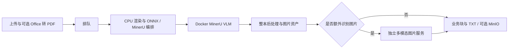

# MinerU 服务调优指南（仓库开发文档）

本文件作为开发运维文档提交 Git，但不通过 FastAPI、llms.txt 或服务文档路由暴露。运行凭证、原始文档和实测输出仍保持私有；不得通过通用静态目录挂载仓库。

适用基线：MinerU 4.0.0、Python 3.12、CPU ONNX 小模型、Docker vLLM 0.21.0、FastAPI 与 Celery。最后核对：2026-09-18。本指南给出资源变化后的测量与选择方法；表中的本机值是已测起点，不是新机器的通用最优值。

安装与故障恢复见[部署与回归](https://github.com/tiangong-ai/unstructure-serve/blob/main/mineru_4_upgrade_usage.md)，接口调用见 [AI 接入指南](ai-integration.md)。先按部署文档获得能正确解析的系统，再调性能。

## 1. 先确定要优化的目标

至少分别记录以下两种目标，避免把吞吐提升误认为单文件延迟下降：

- **交互延迟**：单文件从提交到完整结果的 P50/P95，以及冷启动与已预热差异。
- **批处理吞吐**：固定混合文件集的总完成时间、成功页/秒、成功文档/分钟、失败率和积压量。
- **质量与成本约束**：关键数字/表格/公式/checkbox/阅读顺序的正确性；每页 CPU 时间、GPU 时间、视觉输入/输出 token、内存峰值和临时磁盘峰值。

先写下可接受的 P95、错误率和质量门槛。例如“在关键字段全部通过的前提下优化整批耗时”，不要事后用更低档位或删掉图片来解释加速。不能直接比较纯解析与额外图片增强的耗时。

## 2. 理解实际流水线



一份文件的端到端时间包含上传、Office 转换、排队、解析、图片增强、拼接、存储与轮询观察延迟。阶段内部可并行，不能把多线程 cProfile 的累计时间直接相加当成墙钟时间。

本服务有两套大模型服务：

| 服务 | 配置入口 | 工作内容 | 当前分配方式 |
| --- | --- | --- | --- |
| MinerU VLM | `MINERU_MODEL_VLM_SERVER_URL` | 版面区域解析等 MinerU 推理 | 本机单容器、DP=3、TP=1，单 URL 内部分配请求 |
| 独立图片描述 | `VLLM_BASE_URLS` / `VLLM_BASE_URL` | 对提取图片补充事实描述 | 当前两个可用端点、相同模型；应用进程内轮换优先端点，失败再试下一个 |

图片模型的轮询不是按 GPU 利用率或队列深度加权；MinerU 多 URL 池也没有图片服务同样的故障切换语义。相同 URL 的多个别名不等于新增推理容量。

DP 主要增加可同时处理的请求数。一个长文档如果产生很多独立区域请求，也可能因多个副本同时工作而提速，但单次自回归生成不会自动被三卡分成三段。不要先把 PDF 拆成单页任务以追求均分：整本后处理、跨页连续性和源页号是必须保留的合同。

## 3. 建立资源账本

每次变更记录 Git commit、`uv.lock`、容器镜像及实际 digest、模型/量化版本、有效配置、CPU/GPU 拓扑和测试文件摘要。不要把 `.env`、密钥、真实模型服务地址、文档内容或完整 PM2 环境写入公共报告。

本机只读盘点命令：

```bash
lscpu
free -h
nvidia-smi --query-gpu=index,name,memory.total,memory.used,utilization.gpu --format=csv
df -h /tmp .
pm2 status
docker compose -p mineru-vlm-parallel -f compose.mineru.yaml -f compose.mineru.parallel.yaml ps
```

还需记录容器或 cgroup 的 CPU/内存配额、NUMA、GPU 间互联、共享 GPU 上其他服务的峰值、Redis/磁盘/网络延迟。宿主机总核数和总内存不一定是本服务可用资源。

以下仅用于规划实验，不是硬性计算公式：

- CPU 压力约随“活跃解析进程 × 每个模型会话的 intra 线程”增长；每进程还可能有多个会话、PDF 渲染池和网络线程。
- RAM 峰值约为常驻模型/服务，加上各活跃文档的渲染、布局、图片、上传及输出缓存；不能只按 PDF 文件体积估算解码图片内存。
- 每 GPU 显存需求包括权重、KV cache、视觉 encoder、中间激活及运行时保留。`gpu-memory-utilization` 是预算，不是 OS 级隔离，也不保证别的进程随后申请显存时仍有余量。
- 稳态平均在途数可用 Little 定律 `L ≈ λ × W` 帮助理解；不要用平均值替代 P95 或忽略突发、失败重试和文件长尾。

本机基线：3 个 parse solo worker、ONNX intra/inter=16/1、每 parser VLM 并发 8、处理窗口 64 页；Docker DP/TP=3/1、每 GPU 显存比例 0.15、max-model-len=8192、max-num-seqs=16；two-stage vision threads=32；同步图片每请求窗口 3；批量客户端在途 6。基础 Compose 的单卡替代与三卡模板不能同时管理同一 project。

## 4. 用同一套样本建立基准

### 4.1 样本与正确性门槛

`input` 有 11 份私有 PDF。至少包含：p2 短表格/checkbox、九页论文的公式与图、46 页 fese、长文档首/中/尾页、扫描件；Office 业务另加 DOCX/PPT/XLS 转换样本。性能主集合按实际业务的页数、分辨率和图片比例加权，不要仅测 p2。

检查页数与源页号、非空内容、图片文件存在、表格/公式/数字/正负号/单位、checkbox、阅读顺序、图片与文字不重复错位。改变视觉模型或提示词时，用固定原图和固定上下文检查输出；保留原图，不以更小图片的结果冒充同条件对比。

在仓库根目录执行：

```bash
uv run --group dev pytest
MINERU_RUN_INPUT_PDFS=1 uv run --group dev pytest tests/test_mineru_input_pdfs.py -v
MINERU_RUN_DP_PDFS=1 uv run --group dev pytest tests/test_mineru_data_parallel.py -v
MINERU_RUN_VISION_PDFS=1 uv run --group dev pytest tests/test_vision_input_pdf.py -v
```

后两项分别要求三卡 MinerU 服务、可用的独立图片模型。三卡测试断言恰好三个 engine；拓扑变成一/二/四卡时，先按预期副本数维护测试，不能把原测试跳过解释为新拓扑已验证。完整 PDF 回归耗时较长；只运行筛选子集时须记录覆盖范围。

### 4.2 SDK 解析基准

输出目录必须未存在。以下示例对三种文件循环提交六份，每个进程先预热，测量完整解析与资产保存；不含 HTTP、Celery、独立图片描述和 MinIO。

```bash
MINERU_INTRA_OP_NUM_THREADS=16 MINERU_INTER_OP_NUM_THREADS=1 \
uv run python -m src.scripts.benchmark_mineru \
  --workers 3 --concurrency 8 --window 64 --jobs 6 \
  --files input/p2.pdf \
    input/wu-et-al-2025-carbon-footprint-of-battery-grade-lithium-chemicals-in-china.pdf \
    input/fese.pdf \
  --output output/tuning/baseline-run-01
```

读取 `report.json` 中的 batch wall time、pages_per_second、service P50/P95 和 completion P95。`service_seconds` 不含 worker 队列等待，`completion_seconds` 含等待；初始化预热不计入批次耗时。

### 4.3 端到端与容量基准

再通过真实 API 测试纯解析、图片增强和业务需要的 MinIO；批量可使用现有 two-stage 脚本，见 AI 指南。脚本的提交窗口不是压测报告器，需要另记提交、开始/阶段完成、最终成功时间及错误数量。

对每组配置先预热，重复至少三轮，交错基线与候选顺序，分别报告中位数和范围；正式 P95 需要足够任务样本，六份文件的 P95 不能代表生产尾延迟。排队期间保持输入速率可控，观察队列能否回落。每轮保存输出到新的私有目录，确认无重试任务混入计时。

## 5. CPU 和内存变化时

| 现象 | 优先测量 | 调整顺序 |
| --- | --- | --- |
| CPU 满、GPU 等待 | ONNX/渲染时间、线程数、上下文切换 | 先扫 intra，再扫解析进程数；避免二者同时翻倍 |
| 核数增多但更慢 | 多会话线程竞争、NUMA、内存带宽 | intra 试 4/8/16，inter 先 1；必要时测绑定 CPU/NUMA |
| RAM 紧张或开始 swap | 单长文件峰值、同时活跃文件数、渲染窗口 | 降解析进程数或 window 64→32→16，再降客户端在途 |
| RAM 充足、GPU 不饱和 | CPU/网络是否真正有余量 | 小步增加 parser 或请求并发，测吞吐与 P95 |
| 上传后还没入队就慢 | Office 转换、上传缓存、磁盘 | 分离转换耗时；增加 worker 不会缩短入队前转换 |

`MINERU_INTRA_OP_NUM_THREADS` / `MINERU_INTER_OP_NUM_THREADS` 由 ONNX 会话使用，不是全进程线程限额。默认自动线程池在高核机器上未必最优。本机已经测过低线程和高并发方案，16/1 仅是当前混合样本的选择。

`MINERU_PROCESSING_WINDOW_SIZE` 控制内部处理窗口，不是页数上限，也不把结果拆成多个独立文档。缩小窗口可能减少峰值内存但增加调度成本；调后检查整本末页和跨页顺序。

普通/sync scheduler 的 `GPU_IDS` 是应用进程内的历史调度槽位，并会设置子进程可见设备；它不改变 Docker 绑定的卡或 DP。多个 Gunicorn 进程各有 scheduler，增加 API worker 或槽位会叠加解析压力，不是增加 MinerU GPU 副本的正确入口。

## 6. GPU 数量、显存和模型变化时

### 6.1 先选拓扑，再调容量

- 模型能单卡容纳，目标是并发吞吐：优先比较独立副本/DP；本机为 DP=3、TP=1。
- 模型单卡放不下：评估 TP 或兼容的量化，同时考虑通信开销、互联和质量。TP 可以改变单请求延迟，但不保证加速。
- 卡数足够且模型需多卡：可评估 DP×TP 组合，每副本使用 TP 张卡；不要把这个规划公式当成本项目所有模型都已验证支持。
- GPU 型号/显存不一致：优先隔离服务并单独测容量，不直接套用相同显存比例或同步 TP。当前客户端没有按异构端点容量加权的调度。

DP/TP 原理参考 [vLLM 官方部署说明](https://docs.vllm.ai/en/latest/serving/data_parallel_deployment/)；其中新版本参数需与本项目固定的 vLLM 0.21.0 核对后使用。

### 6.2 本仓库具体修改位置

三卡模板 `compose.mineru.parallel.yaml` 中的 `device_ids`、`--data-parallel-size` 和 `--tensor-parallel-size` 是显式值。卡数变化须一起修改，并检查测试/PM2/文档；不存在只改 `GPU_IDS` 就自动扩卡的能力。基础 `compose.mineru.yaml` 的 `MINERU_DOCKER_GPU_ID` 只用于单卡拓扑。

`MINERU_DOCKER_GPU_MEMORY` 在 Compose/PM2 中设置，当前 0.15 是给共享 GPU 留空间后的本机配置，不是所有机器建议。max-model-len=8192、max-num-seqs=16 在 Compose command 中固定；修改镜像、模型、长度或序列数要重新测峰值和启动所需显存。扩大最大上下文不是免费提速，并发序列数也不是每秒吞吐。

MinerU VLM 依赖匹配的解析模型和输出协议，不能把它直接替换成任意聊天模型。独立图片描述模型才通过 `VISION_MODEL` 等选择通用多模态模型。模型镜像升级仍在 Docker 内完成，不给应用 `.venv` 安装 vLLM。

扩卡验收必须做实际推理，并验证每个预期 engine 的成功请求计数增长；只看 GPU 显存占用或 `/health` 不够。重启后检查 UVM 映射和容器内 CUDA 运算，避免 `nvidia-smi` 正常但推理失败。

## 7. 队列和文件并发

先固定模型配置，再扫解析 worker 数，例如 1→2→3；每个都使用独立节点名、solo/1、prefetch=1，保留 urgent/normal 队列顺序。随后扫每 parser 的 `MINERU_MODEL_VLM_MAX_CONCURRENCY`，例如 4→8→16。三进程×8 表示多个独立客户端可能同时产生请求，不等于服务器固定只有 24 个序列，也不包含别的 API 或客户端流量。

当前两个 Celery app 的消费队列不同：普通 worker 消费 `queue_urgent,queue_normal,default`；two-stage 使用各自 parse/vision/dispatch/merge 队列。API 和 worker 的队列环境必须一致。不要把“有 Celery worker 在线”当成某个入口一定有人消费；也不要让普通 worker 无意抢占 two-stage 的共享 default 队列任务。

长任务的预取会影响公平性，相关行为参考 [Celery 优化文档](https://docs.celeryq.dev/en/stable/userguide/optimizing.html)。parse 使用 solo 是为了允许 SDK 再创建渲染子进程，不随意换成 daemonic prefork。

客户端批量窗口 `TWO_STAGE_MAX_IN_FLIGHT` 当前为 6。可从约两倍 parse worker 数开始实验，但图片多、文件大或视觉阶段慢时应减少积压，并同时观察全流水线；它不是全局准入控制。一次上传数千文件通常只增加磁盘与等待，未必增加吞吐。

## 8. 独立多模态图片服务调优

### 8.1 数量与并发

`VISION_BATCH_SIZE` 只控制同步/普通图片任务每文档的滚动窗口，当前代码/模板 3；two-stage 用 vision worker 的 `-P threads -c 32`。这些并发会与其他请求/worker 叠加。增加端点数前先确认是不同推理容量，而非同一后端的两个地址。

用固定六图或更大的业务图集，测试并发 1/3/6/12 等，每组记录成功率、每图及整批延迟、排队、429/超时、输出 token、图片模型 GPU 利用率和质量。不同端点单独测，再测组合；当前轮询与顺序故障切换不具备熔断、动态权重或全局限流，慢/故障端点会拖累尾延迟。需要这些能力时另行实现网关/调度，不靠无限提高线程数。

### 8.2 质量与成本

默认请求 `enable_thinking=false`。Qwen3.5 公开模板与本机使用 temperature/top_p/top_k/presence_penalty=0.7/0.8/20/1.5；通用代码默认仍为 1/1/40/2，`min_p=0`、`repetition_penalty=1`。这是特定模型配置，不应盲目复制给其他模型；更换模型时核对是否接受 `chat_template_kwargs`、top_k 等扩展参数。

独立模型选择涉及 `VISION_MODEL`、`VISION_MODELS_VLLM`、`VISION_DEFAULT_MODEL_VLLM` 及 endpoint 的实际 served model name。同步/普通任务对未知值可能兜底，而 two-stage 在路由层校验枚举；更新后同时重载 API 与相关 worker，并重新读取 OpenAPI，不以 200 状态推断一定用了指定模型。

保持原图质量，先减少重复输出，再讨论图像分辨率或量化。现有提示词要求保留数字/单位/标签和关系；清理正则只处理固定前缀，不能修复模型幻觉。空/截断响应应失败，不能设置一个很小的输出上限然后默默丢掉后半张图。严格 OCR 场景不能套用“省略重复内容”的普通图片策略。

大模型/小模型、量化、thinking、上下文窗口和 prompt 应分开实验。若要按图片复杂度选择不同模型、自动复核或使用不同 endpoint 各自的 model name，当前统一模型轮询池不能直接表达，需要新增明确路由及质量评估。

## 9. Python、存储和网络

用 cProfile/采样剖析区分序列化、拼接、图片 base64、磁盘与模型等待。当前文本拼接使用列表 join、共享 surrogate 清理，不重复 UTF-8 编解码；保持阅读顺序和标题换行合同。不要未经剖析把所有后处理移到更多线程，Python 线程不保证 CPU 字符串处理更快。

当前同步隔离任务已经显式关闭 DocVortex 渲染池；不要通过更短的 watchdog 或提前返回来隐藏进程退出耗时。临时目录、图片和跨 worker 共享路径必须继续正确收尾。

MinIO 逐页 JPEG、parsed.json、PDF 和 meta 上传应单独计时。Redis result backend 不是永久结果存储；大文本会增加内存和网络压力，及时落盘并按实际 app 的结果过期策略获取结果。当前 two-stage app 未直接使用普通 app 的 `CELERY_RESULT_EXPIRES` 配置，不假定改这一个变量就能同时改变两类任务 TTL。远端视觉上传的图片体积和网络往返也会限制吞吐。

## 10. 变更与回滚步骤

1. 保存上一版有效配置、镜像和测量报告到私有目录，记录部署 commit。配置优先级是进程环境 > `.env` > TOML；PM2 env 不会被 `.env` 自动覆盖。
2. 查 active/reserved 与各队列，等待相关任务完成。只操作本项目指定进程或 Compose project，保留缓存卷，不重启共享 Docker/驱动。
3. 每次只改一类参数，先低并发质量回归，再混合压测，再端到端验证；长尾与内存失败也计入结果。
4. 按变更重载对应 API/worker 或重建模型容器。模型拓扑变化使用该 project 唯一的 PM2/Compose 管理入口，不能再启动另一套重叠容器。
5. 检查 `/health`、`/ready`、队列、实际任务和所有 engine。`/ready` 仅探测 MinerU 端点健康，不覆盖 Redis、独立视觉模型、MinIO或真实 CUDA 推理。
6. 质量不达标、OOM、错误率或尾延迟恶化时回滚候选配置，复测；稳定后 `pm2 save` 并更新部署说明和 AGENTS.md。

只读队列检查：

```bash
uv run celery -A src.services.two_stage_pipeline inspect active --timeout=5
uv run celery -A src.services.two_stage_pipeline inspect reserved --timeout=5
uv run celery -A src.services.two_stage_pipeline inspect active_queues --timeout=5
```

这些输出可能含任务路径/参数，仅作私有诊断。不要发布完整 PM2 环境、Redis 内容或业务任务日志。

## 11. 已有证据怎样使用

2026-09-18 的本机单轮对照：p2 同步平均 9.75→4.29 秒主要来自渲染池退出修复；同一份 fese 业务拼接 7.86→5.97 毫秒只是小比例优化。30 份 p2 使用在途 30/6/3，整批分别 26.61/26.44/30.33 秒。固定六图的旧/新提示词与采样对照，输出 token 2753→2303；九页论文整份仅 49.16→48.19 秒，因为解析仍占约 31 秒。

这些结果说明应先找固定开销和真正瓶颈，不能保证换 CPU/GPU/模型后保持同样比例。记录表建议：

| 项目 | 每轮必填 |
| --- | --- |
| 版本与资源 | commit、镜像 digest、模型、CPU/内存配额、GPU/显存及共享负载 |
| 有效参数 | parse 数、ONNX 线程、VLM 并发、window、DP/TP、视觉端点/并发/采样 |
| 工作负载 | 文件摘要、页数/图片数、tier、接口、冷/热、到达模式 |
| 性能 | 成功吞吐、端到端 P50/P95、各阶段时间、错误/重试、资源峰值 |
| 质量与结论 | 检查项、失败样本、重复轮数、是否采用、回滚配置 |

找到在质量和尾延迟约束下的稳定拐点后停止加并发；资源有空闲本身不是必须提高占用率的理由。


## 12. 400–1000 页整本批量的专项准入

接口选择与投递步骤见 [AI 指南第 5.3 节](ai-integration.md#53-多份-4001000-页-pdf-的投递流程)。原有长样本抽页测试与短文件吞吐测试不是千页整本容量验收。先单份代表性整本，再 2/3 份，覆盖扫描/图表密集样本，检查末页有效内容、各阶段耗时、RAM、磁盘、结果体积和错误/重投。

2026-09-18 代码核对发现的长任务约束（本节记录问题，不代表已经修改配置）：

| 层次 | 当前行为 | 千页验收要求 |
| --- | --- | --- |
| 提交 HTTP | 批量脚本 POST timeout=120 秒；路由会读取整份上传字节 | 依据文件体积/带宽设置客户端和网关预算，并测同时上传 RAM 峰值 |
| 客户端轮询 | 脚本默认总等待 800 秒，GET timeout=30 秒 | 覆盖排队+完整流水线；超时续查原 ID，不能重投 |
| 普通异步解析 | 经 scheduler 的独立子进程 hard timeout；全局代码缺省 600 秒，再受对应进程配置覆盖 | 检查普通 worker 的实际环境，不以 API PM2 的 1800 秒推定 worker 同值 |
| two-stage parse | 直接调用 parse_doc，未走 scheduler；app 未配置 task_time_limit | 不把 scheduler 的 hard timeout 当成这里的保护；solo/threads 也不能假定具有 prefork 的终止能力 |
| Redis 未确认消息 | two-stage late ack，当前未覆盖 Redis 默认 visibility timeout=3600 秒 | 单个消息未确认时长可能超过一小时，应先完成超长任务方案；不能仅延长客户端等待 |
| two-stage 中间/最终结果 | 当前 app 结果过期采用 Celery 默认一天；普通 app 的 CELERY_RESULT_EXPIRES 没有直接接到此 app | 保留时间覆盖最慢图片及 chord 汇总和客户端结果获取，按运行 app 验证 |
| 停机 | parse PM2 等待窗口 1900 秒 | 长任务超此时间时不要在活跃中重启；扩大预算须与恢复机制一起评估 |

Redis visibility timeout 到期可使未确认任务被重新投递；扩大它也会延迟故障后的恢复。Celery 要求相关 broker/backend/app 设置一致，共享 broker 的应用存在较短设置时还会影响效果，见 [Celery Redis 官方说明](https://docs.celeryq.dev/en/stable/getting-started/backends-and-brokers/redis.html#visibility-timeout)。当前项目没有把一个 `CELERY_VISIBILITY_TIMEOUT` 环境变量自动接入所有这些配置；只在 `.env` 写一个名称不会生效。需要实现并验证一致配置，或给长任务提供已验证的独立执行/恢复方案，不能只改某个 worker 的一个参数。

容量验收中应同时检查同一 task_id 的执行事件/日志，避免两个 worker 重复处理同一工作区；客户端没有重复 POST 不代表 broker 不会重投。图像任务一次 fan-out，API 也没有全局按页数/图片数/字节的准入预算；客户端在途 2 是起始实验，不是内存安全保证。若缺少可接受的任务时长上界、可靠终止或恢复能力，先补齐执行隔离/幂等与监控，再开放大规模长任务。

不得直接把 PDF 切成 50/100 页后声称行为等价。若单份整本在预算内不能完成，应先调整资源/窗口、档位选择及执行机制；必须分段时另行设计源页偏移、跨段表格/段落/脚注衔接、图像去重与完整性验收。当前公共 API 不提供此类透明分段恢复能力。
